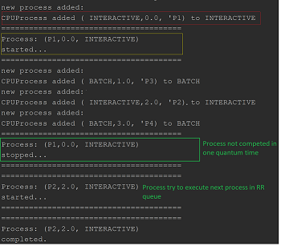

# CPU scheduler with MQS algorithm implementation
## DESCRIPTION
### Brief description
A test of implementing the basic work of MQS (Multiply Queue Scheduler) algorithm.
According to MQS all CPU process can be divided into separate groups. Each them has unique priority in
general process queue (0 - has the highest priority).

There are two types of CPU process
> INTERACTIVE -> priority = 0
> BATCH -> priority = 1

### Algorithm description
## DEMONSTRATION

#### The allocation of the `int` sized block of memory with further initialization of it.
##### Code
```
```
##### Output

#### The reallocation of the previously created block of memory to size 10.
##### Code
```
```
##### Code
```
```
##### Output
![The deletion of the int variable](resources/MQS.png | width=100 "Stopping process with lower priority"
