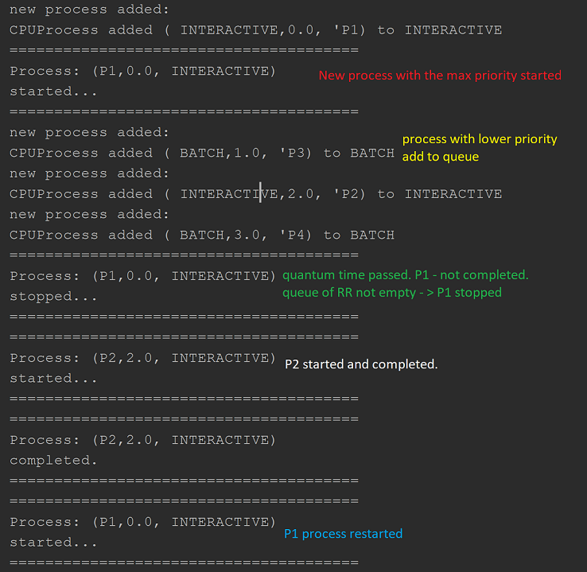
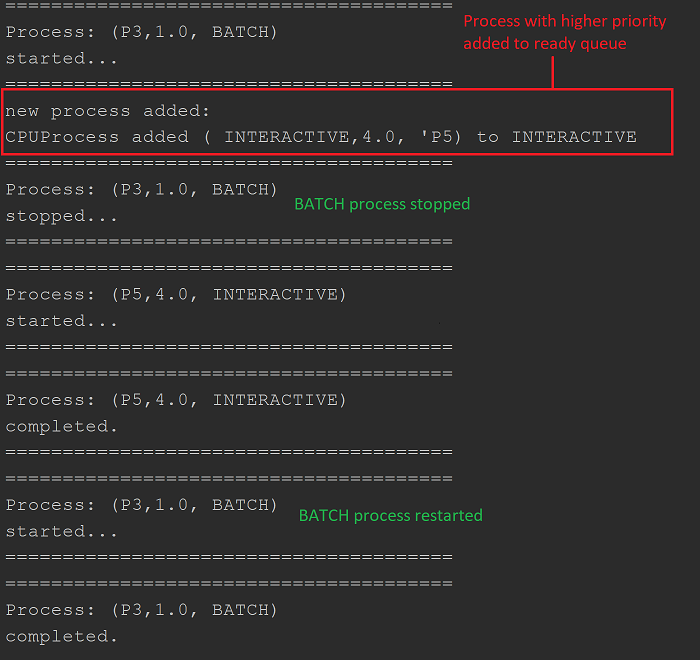
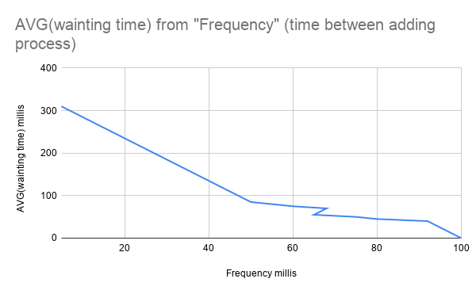
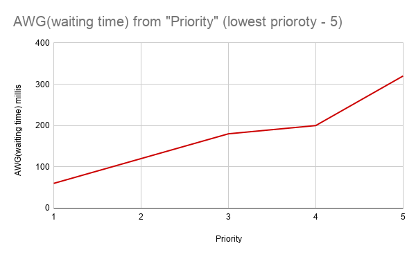

# CPU scheduler with MQS algorithm implementation
## DESCRIPTION
### Brief description
A test of implementing the basic work of MQS (Multiply Queue Scheduler) algorithm.
According to MQS all CPU process can be divided into separate groups. Each them has unique priority in
general process queue (0 - has the highest priority).


There are two types of CPU process
> INTERACTIVE -> priority = 0
> BATCH -> priority = 1

### Algorithm description

Multiply queue key concept refers to creating system with strong association between particular values of priority
and different strategies of creating, manipulating and executing process queues.
Process should be terminated and placed into the end/beginning of it`s queue (depends on algorithm that used for queue
associated with this priority) while another one with the higher priority is arrived.

I choose RRobin algorithm for queue with the highest priority (INTERACTIVE processes) and used FIFO strategy for other
queues.

#### Round Robin (RR) algorithm description

RR is a CPU scheduling algorithm where each process is assigned a fixed time slot in a cyclic way.
The flow of this algorithm can be enplaned by pseudo-code listed below:
1. First process of in queue is started.
2. While quantum time passes, check if current process is completed.
    2.1. if it is, return to step (1).
    2.2. else check if queue contains other process:
        2.2.1. if it is, stop current process and add it into the end of queue, return to step (1)
        2.2.2. return to  step (2) for current process.
3. if queue is empty return;

#### FIFO for MQS algorithm description

FIFO concept is standard. Process that was added first -- will be executed first, however, to implement MQS algorithm
in some additional steps were added.

1. First process in queue are started
2. check is no process with higher priority was added
    2.1 if it was, stop current process and add it into the start of current queue. try to execute process with higher priority
    2.2. else continue executing process while quantum time.
3. When quantum time is passed -- check if process is completed:
    3.1 if it was -- take next process and go to step (2)
    3.2 else go to step (2);
4. while queue is no empty continue;
5. return.

System variables include:
- ***Quantum*** value = 100 ms.
> (usually lies in the interval [0, 100].  to make testing process easier)

## DEMONSTRATION

##### Code example
```
scheduler = new Scheduler();
Thread thread = new Thread(scheduler);
thread.start();
scheduler.execute(new CPUProcess(CPUProcess.ProcessType.INTERACTIVE, 0.0, 220, "P1"));
scheduler.execute(new CPUProcess(CPUProcess.ProcessType.BATCH, 1.0, 400, "P3"));
Thread.sleep(50);
scheduler.execute(new CPUProcess(CPUProcess.ProcessType.INTERACTIVE, 2.0, 20, "P2"));
scheduler.execute(new CPUProcess(CPUProcess.ProcessType.BATCH, 3.0, 200, "P4"));
Thread.sleep(250);
scheduler.execute(new CPUProcess(CPUProcess.ProcessType.INTERACTIVE, 4.0, 20, "P5"));
scheduler.close();
```

#### Executing process with the highest priority.

##### Output


#### Stop and restart BATH process while INTERACTIVE process arrived.

##### Output


#### Graphics

> Graphic of AVG(waiting time) for CPU processes (max complete time 150millis). Frequency axis
> refers to interval between adding requests to CPU.

Structure of graphic below allows to claim that there is indeed a strong correlation between interval
of incoming requests and awg waiting time.

##### Output


> Graphic of AVG(waiting time) for CPU processes (max complete time 150millis). Priority axis
> refers to range of priority class.

To simulate inner-commands system, 5 types of process were created. The interval between requests is 50 millis
(1/3 MAX completing time)
As we can see from picture below - the higher priority of CPU process the less AWG waiting time value
for this types of process will be achieved.
Max time was achieved for 5-th priority

##### Output
