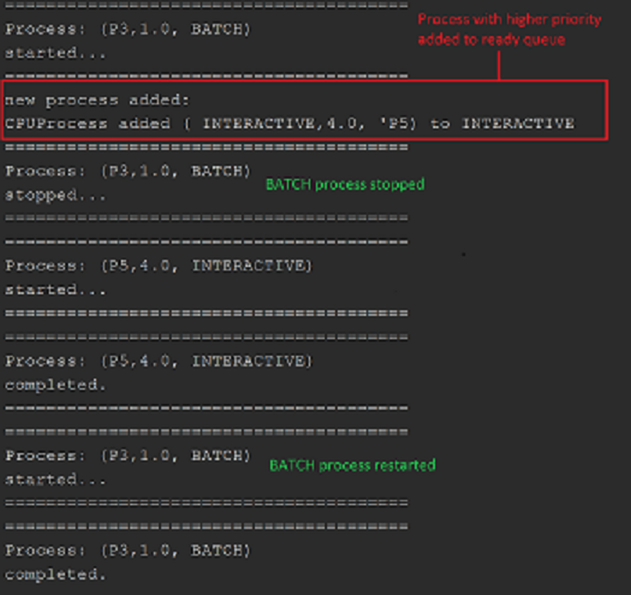

# CPU scheduler with MQS algorithm implementation
## DESCRIPTION
### Brief description
A test of implementing the basic work of MQS (Multiply Queue Scheduler) algorithm.
According to MQS all CPU process can be divided into separate groups. Each them has unique priority in
general process queue (0 - has the highest priority).


There are two types of CPU process
> INTERACTIVE -> priority = 0
> BATCH -> priority = 1

### Algorithm description

Multiply queue key concept refers to different strategies


## DEMONSTRATION

##### Code example
```
scheduler = new Scheduler();
Thread thread = new Thread(scheduler);
thread.start();
scheduler.execute(new CPUProcess(CPUProcess.ProcessType.INTERACTIVE, 0.0, 220, "P1"));
scheduler.execute(new CPUProcess(CPUProcess.ProcessType.BATCH, 1.0, 400, "P3"));
Thread.sleep(50);
scheduler.execute(new CPUProcess(CPUProcess.ProcessType.INTERACTIVE, 2.0, 20, "P2"));
scheduler.execute(new CPUProcess(CPUProcess.ProcessType.BATCH, 3.0, 200, "P4"));
Thread.sleep(250);
scheduler.execute(new CPUProcess(CPUProcess.ProcessType.INTERACTIVE, 4.0, 20, "P5"));
scheduler.close();
```

#### Executing process with the highest priority.

##### Output


#### Stop and restart BATH process while INTERACTIVE process arrived.

##### Output


#### Graphics

> Graphic of AVG(waiting time) for CPU processes (max complete time 150millis). Frequency axis
> refers to interval between adding requests to CPU.

As we ca

##### Output


> Graphic of AVG(waiting time) for CPU processes (max complete time 150millis). Priority axis
> refers to range of priority class.

To simulate inner-commands system, 5 types of process were created. The interval between requests is 50 millis
(1/3 MAX completing time)
As we can see from picture below - the higher priority of CPU process the less AWG waiting time value
for this types of process will be achieved.
Max time was achieved for 5-th priority

##### Output
